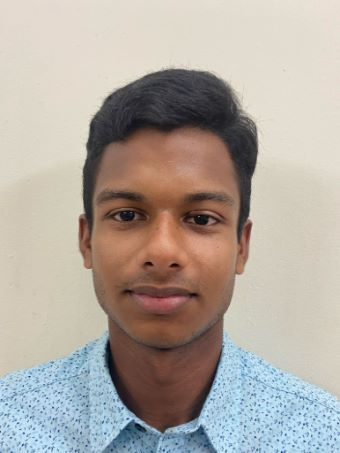
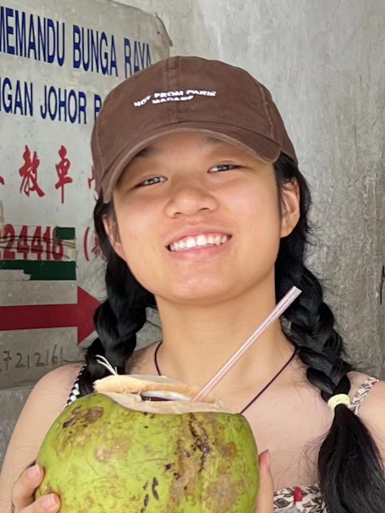
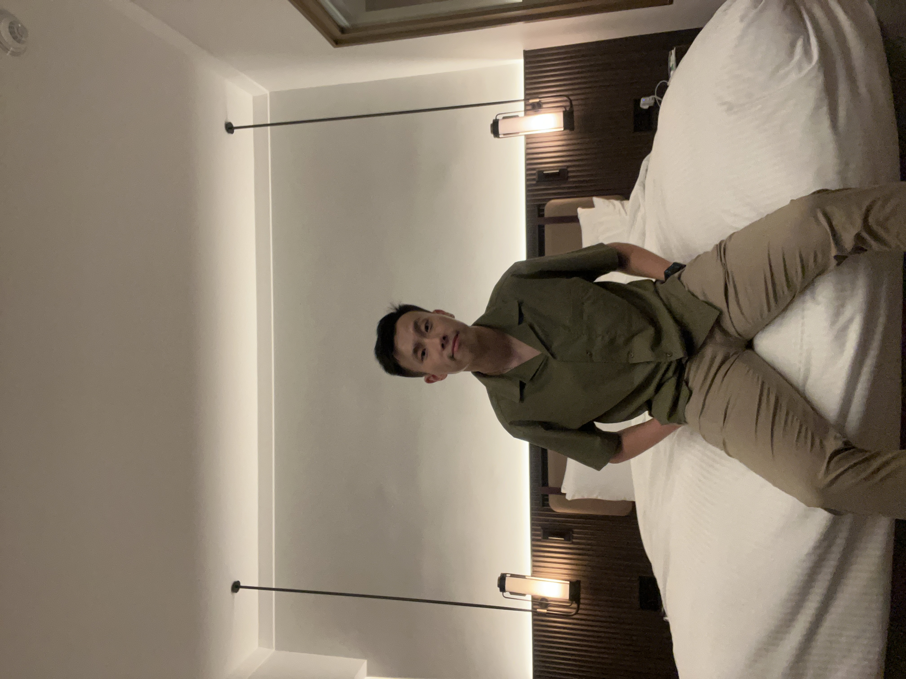

# About Us

We are a team based in the [School of Computing, National University of Singapore](http://www.comp.nus.edu.sg).

You can reach us at the email `seer[at]comp.nus.edu.sg`

## Project team

### Khaleelur Rahman

[[github](http://github.com/Khaleelur-Rahman)]
[[portfolio](team/khaleelur-rahman.md)]

* Role: Backend Developer
* Responsibilities: Implementation of various backend features

### Tong Xinyao

[[github](http://github.com/xyT-T)] [[portfolio](team/xyt-t.md)]

* Role: Backend Developer
* Responsibilities: Implementation of various features

### Jaryl Goh Jun Zhong

[[github](http://github.com/rionshocker)]
[[portfolio](team/rionshocker.md)]

* Role: UI Lead
* Responsibilities: Implementation of various features involving UI

### Shankar Anand

[[github](http://github.com/vijay-shankaranand)]
[[portfolio](team/vijay-shankaranand.md)]

* Role: Backend Developer
* Responsibilities: Implementation of various features

### Choo Tze Jie

[[github](http://github.com/tjch-o)]
[[portfolio](team/tjch-o.md)]

* Role: UI Developer
* Responsibilities: Implementation of various features involving UI
