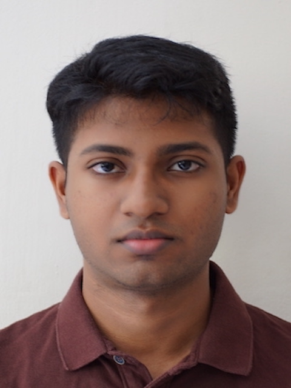

# About Us

We are a team based in the [School of Computing, National University of Singapore](http://www.comp.nus.edu.sg).

## Project team

### John Doe

[[homepage](http://www.comp.nus.edu.sg/~damithch)]
[[github](https://github.com/johndoe)]
[[portfolio](team/vijay-shankaranand.md)]

* Role: Project Advisor

### Shankar Anand

[[github](http://github.com/vijay-shankaranand)]
[[portfolio](team/vijay-shankaranand.md)]

* Role: UI Expert
* Responsibilities: Scheduling and tracking, UI

### Johnny Doe

[[github](http://github.com/johndoe)] [[portfolio](team/vijay-shankaranand.md)]

* Role: Developer
* Responsibilities: Data

### Jean Doe

[[github](http://github.com/johndoe)]
[[portfolio](team/vijay-shankaranand.md)]

* Role: Developer
* Responsibilities: Dev Ops + Threading

### James Doe

[[github](http://github.com/johndoe)]
[[portfolio](team/vijay-shankaranand.md)]

* Role: Developer
* Responsibilities: UI
