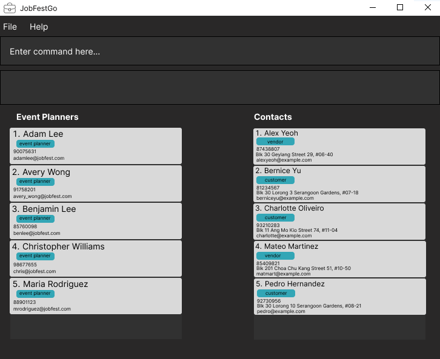

# JobFestGo User Guide

JobFestGo is a **desktop app for managing contacts and tasks, optimized for use via a  Line Interface** (CLI) while still having the benefits of a Graphical User Interface (GUI). It is an task management tool meant to assist you as job festival event planners in cold-calling various personnel (e.g. vendors, customers) and other event-related tasks. This removes the hassle of having to shuffle through your contact list based on names that you might not remember and organise your tasks neatly.

<!-- * Table of Contents -->
<page-nav-print />

--------------------------------------------------------------------------------------------------------------------

## Quick start

1. Ensure you have Java `11` or above installed in your Computer.

1. Download the latest `jobfestgo.jar` from [here](https://github.com/AY2324S1-CS2103T-T09-1/tp/releases).

1. Copy the file to the folder you want to use as the _home folder_ for your JobFestGo.

1. Open a command terminal, `cd` into the folder you put the jar file in, and use the `java -jar jobfestgo.jar` command to run the application. 
   A GUI similar to the below should appear in a few seconds. Note how the app contains some sample data. 

   

1. Type the command in the command box and press Enter to execute it. e.g. typing **`help`** and pressing Enter will open the help window. 
   Some example commands you can try:

   * `list` : Lists all contacts.

   * `add n/John Doe p/98765432 e/johnd@example.com a/John street, block 123, #01-01` : Adds a contact named `John Doe` to JobFestGo.

   * `delete 3` : Deletes the 3rd contact shown in the current list.

   * `clear` : Deletes all contacts.

   * `exit` : Exits the app.

1. Refer to the [Features](#features) below for details of each command.

--------------------------------------------------------------------------------------------------------------------

## Features

<box type="info" seamless>

**Notes about the command format:** 

* Words in `UPPER_CASE` are the parameters to be supplied by the user. 
  e.g. in `add n/NAME`, `NAME` is a parameter which can be used as `add n/John Doe`.

* Items in square brackets are optional. 
  e.g `n/NAME [t/TAG]` can be used as `n/John Doe t/friend` or as `n/John Doe`.

* Items with `…`​ after them can be used multiple times including zero times. 
  e.g. `[t/TAG]…​` can be used as ` ` (i.e. 0 times), `t/friend`, `t/friend t/family` etc.

* Parameters can be in any order. 
  e.g. if the command specifies `n/NAME p/PHONE_NUMBER`, `p/PHONE_NUMBER n/NAME` is also acceptable.

* Extraneous parameters for commands that do not take in parameters (such as `help`, `list`, `exit` and `clear`) will be ignored. 
  e.g. if the command specifies `help 123`, it will be interpreted as `help`.

* If you are using a PDF version of this document, be careful when copying and pasting commands that span multiple lines as space characters surrounding line-breaks may be omitted when copied over to the application.
</box>

### Viewing help : `help`

Shows a message explaining how to access the help page.

Format: `help`

### Adding a person: `add`

Adds a person to JobFestGo.

Format: `add n/NAME p/PHONE_NUMBER e/EMAIL a/ADDRESS [t/TAG]…​`

* A person can have any number of tags
* A person must have mandatory fields name, phone number, email and address
* Email should be in the appropriate (@xxx.com) format
* Phone number should be in appropriate (8-digit numeric) format
* Only tags from tags list can be used for tagging a person
* A person cannot be added if their phone number already exists
* A person cannot be added if their name already exists

Examples:
* `add n/John Doe p/98765432 e/johnd@example.com a/John street, block 123, #01-01`
* `add n/Betsy Crowe t/friend e/betsycrowe@example.com a/Newgate Prison p/1234567 t/criminal`

### Listing all persons : `list`

Shows a list of all persons in JobFestGo.

Format: `list`

### Editing a person : `edit`

Edits an existing person in JobFestGo.

Format: `edit INDEX [n/NAME] [p/PHONE] [e/EMAIL] [a/ADDRESS] [t/TAG]…​`

* Edits the person at the specified `INDEX`. The index refers to the index number shown in the displayed person list. The index **must be a positive integer** 1, 2, 3, …​
* At least one of the optional fields must be provided.
* Existing values will be updated to the input values.
* When editing tags, the existing tags of the person will be removed i.e adding of tags is not cumulative.
* You can remove all the person’s tags by typing `t/` without
    specifying any tags after it.

Examples:
*  `edit 1 p/91234567 e/johndoe@example.com` Edits the phone number and email address of the 1st person to be `91234567` and `johndoe@example.com` respectively.
*  `edit 2 n/Betsy Crower t/` Edits the name of the 2nd person to be `Betsy Crower` and clears all existing tags.

### Locating persons by name: `find`

Finds persons whose names contain any of the given keywords.

Format: `find KEYWORD [MORE_KEYWORDS]`

* The search is case-insensitive. e.g `hans` will match `Hans`
* The order of the keywords does not matter. e.g. `Hans Bo` will match `Bo Hans`
* Only the name is searched.
* Only full words will be matched e.g. `Han` will not match `Hans`
* Persons matching at least one keyword will be returned (i.e. `OR` search).
  e.g. `Hans Bo` will return `Hans Gruber`, `Bo Yang`

Examples:
* `find John` returns `john` and `John Doe`
* `find alex david` returns `Alex Yeoh`, `David Li` 

  

### Deleting a person : `delete`

Deletes the specified person from JobFestGo.

Format: `delete INDEX`

* Deletes the person at the specified `INDEX`.
* The index refers to the index number shown in the displayed person list.
* The index **must be a positive integer** 1, 2, 3, …​

Examples:
* `list` followed by `delete 2` deletes the 2nd person in JobFestGo.
* `find Betsy` followed by `delete 1` deletes the 1st person in the results of the `find` command.

### Adding a tag : `add_tag`

Adds a tag to JobFestGo.

Format: `add_tag t/TAG_NAME`

* Adds the tag with the specified tag name `TAG_NAME`.
* The tag name **must not already exist** in JobFestGo.
* The tag name` must be alphanumeric, i.e, should consist only of alphabets and numbers, and no other characters.
* The command must contain `t/` for the command to be valid.
* The tag name must be specified in the command.

Examples:
* `add_tag t/vendor`

### Viewing all tags: `view_tags`

Views all existing tags that have been created by the user.

Format: `view_tags`

### Deleting a tag: `delete_tag`

Deletes the specified tag from JobFestGo.

Format: `delete_tag t/TAG_NAME`

* Deletes the tag with the specified tag name `TAG_NAME`.
* The tag name **must be an existing tag** vendor, personal, customer, …​
* The command must contain `/t` for the command to be valid.
* The tag name must be specified in the command.

Examples:
* `delete_tag` followed by `t/vendor` deletes the tag: vendor in JobFestGo.

### Filtering contacts by tag: `filter`

Displays contacts tagged by any of the given tags.

Format: `filter TAG_NAME [MORE_TAG_NAMES]`

* Tag names are case-insensitive. e.g `Vendor` will match `vendor`
* Only full words will be matched e.g. `ven` will not match `vendor`
* Contacts tagged by at least one of the given tags  will be returned (i.e. `OR` search).
  e.g. `vendor customer` will return all contacts tagged by `vendor` and
 all contacts tagged by `customer`

Examples:
* `filter vendor` returns all contacts tagged by the tag: vendor in JobFestGo.
* `filter vendor customer` returns all contacts tagged by the tag: vendor and
  all contacts tagged by the tag: customer in JobFestGo.

### Adding an event: `add_event`

Adds an event to JobFestGo.

Format: `add_event n/NAME d/DATE a/ADDRESS`

* An event must have mandatory fields: name, date and address
* The event name **must not already exist** in JobFestGo.
* Date must be valid and should be in the appropriate (YYYY-MM-DD) format
* Date should **not** be before current date

Examples:
* `add_event n/NUS Career Fest 2023 d/2023-12-23 a/NUS` adds an event named `NUS Career Fest 2023` to JobFestGo.

### Deleting an event: `delete_event`

Deletes the event specified at the index from JobFestGo.

Format: `delete_event INDEX`

* Deletes the event specified at the `INDEX` from the list of events of JobFestGo.
* The index refers to the index number shown in the displayed event list.
* The index` **must be a positive integer** 1, 2, 3, …​
* The index must be specified in the command.

Examples:
* `delete_event` followed by `1` deletes the 1st event in the displayed event list.

### Viewing all events: `view_events`

Views all existing events.

Format: `view_events`

### Linking contacts to an event: `link`

Linking specified contacts to the specified event.

Format: `link ev/EVENT_NAME c/CONTACT_NAME [c/MORE_CONTACT_NAMES]`

* Only existing contacts and events in JobFestGo can be linked.
* Contacts that are already linked to the specified event cannot be linked again.
* Only full words will be matched e.g. `NUS Career Fest` will not match `NUS Career Fest 2023`,
  `Alice` will not match `Alice Black`
* The order of the input does not matter. e.g. `link ev/NUS Career Fest c/Alice Black`
 and `link c/Alice Black ev/NUS Career Fest` are both valid commands and will perform
 the same task.
* If there are invalid contacts in the input (e.g. non-existent contacts,
 contacts that are already linked to the specified event), the contacts entered
 before the first invalid contact will be linked while those after will not be linked.
 e.g. if `John Doe` is an invalid contact, `link ev/NUS Career Fest c/Alice Black
 c/John Doe c/Bob Dylan` will link `Alice Black` to the event `NUS Career Fest` while
  `John Doe` and `Bob Dylan` will not be linked.

### Selecting an event: `select_event`

Selects a specified event from JobFestGo. The relevant contacts and tasks will be displayed.

Format: `select_event INDEX`

* Selects the event at the specified `INDEX`. 
* The index refers to the index number shown in the displayed events list.
* The index **must be a positive integer** 1, 2, 3, …​

Examples:
* `select_event 1` selects the first event in the displayed events list.

### Adding a task: `add_task`

Adds a task to an event in JobFestGo.

Format: `add_task n/TASK_DESCRIPTION d/DEADLINE ev/EVENT_NAME`

* Task Description can take any value, no limit to the type of characters.
* Deadline is a date in the format YYYY-MM-DD.
* Deadline should not be before today's date.
* Event name should be the **name of an already existing event**.
* The command must contain all `/n`, `/d` and `/ev` for the command to be valid.
* `TASK_DESCRIPTION`, `DEADLINE`, and `EVENT_NAME` must all be present.

Examples:
* `add_task n/Book Venue d/2023-12-23 ev/NUS Career Fair 2023` adds a `Book Venue` by `2023-12-23` task to the event `NUS Career Fair 2023`

### Clearing all entries : `clear`

Clears all entries from JobFestGo.

Format: `clear`

### Returning to home page : `home`

Returns to the home page of JobFestGo regardless of what screen the user is currently on.

Format: `home`

### Exiting the program : `exit`

Exits the program.

Format: `exit`

### Saving the data

JobFestGo data are saved in the hard disk automatically after any command that changes the data. There is no need to save manually.

### Editing the data file

JobFestGo data are saved automatically as a JSON file `[JAR file location]/data/jobfestgo.json`. Advanced users are welcome to update data directly by editing that data file.

<box type="warning" seamless>

**Caution:**
If your changes to the data file makes its format invalid, JobFestGo will discard all data and start with an empty data file at the next run.  Hence, it is recommended to take a backup of the file before editing it.
</box>

### Archiving data files `[coming in v2.0]`

_Details coming soon ..._

--------------------------------------------------------------------------------------------------------------------

## FAQ

**Q**: How do I transfer my data to another Computer? 
**A**: Install the app in the other computer and overwrite the empty data file it creates with the file that contains the data of your previous JobFestGo home folder.

--------------------------------------------------------------------------------------------------------------------

## Known issues

1. **When using multiple screens**, if you move the application to a secondary screen, and later switch to using only the primary screen, the GUI will open off-screen. The remedy is to delete the `preferences.json` file created by the application before running the application again.

--------------------------------------------------------------------------------------------------------------------

## Command summary

Action     | Format, Examples
-----------|----------------------------------------------------------------------------------------------------------------------------------------------------------------------
**Add**    | `add n/NAME p/PHONE_NUMBER e/EMAIL a/ADDRESS [t/TAG]…​`   e.g. `add n/James Ho p/22224444 e/jamesho@example.com a/123, Clementi Rd, 1234665 t/friend t/colleague`
**Delete** | `delete INDEX`  e.g. `delete 3`
**Edit**   | `edit INDEX [n/NAME] [p/PHONE_NUMBER] [e/EMAIL] [a/ADDRESS] [t/TAG]…​`  e.g. `edit 2 n/James Lee e/jameslee@example.com`
**Find**   | `find KEYWORD [MORE_KEYWORDS]`  e.g. `find James Jake`
**List**   | `list`
**Add Tag** | `add_tag t/TAG_NAME`   e.g. `add_tag t/vendor`
**Delete Tag** | `delete_tag t/TAG_NAME`   e.g. `delete_tag t/vendor`
**Filter** | `filter TAG_NAME [MORE_TAGNAMESS]`   e.g. `filter vendor`
**View Tags** | `view_tags`
**Add Event** | `add_event n/NAME d/DATE a/ADDRESS`   e.g. `add_event n/NUS Career Fest 2023 d/2023-12-23 a/NUS`
**Link** | `link ev/EVENT_NAME C/CONTACT [C/MORE_CONTACTS]`   e.g. `link ev/NUS Career Fest c/Alice Black`
**Delete Event** | `delete_event INDEX`   e.g. `delete_event 1`
**Select Event** | `select_event INDEX`   e.g. `select_event 1`
**View Events** | `view_events`
**Add Task** | `add_task n/TASK_DESCRIPTION d/DEADLINE ev/EVENT_NAME`   e.g. `add_task n/Book Venue d/2023-12-23 ev/NUS Career Fair 2023`
**Clear**  | `clear`
**Help**   | `help`
**Home**   | `home`
